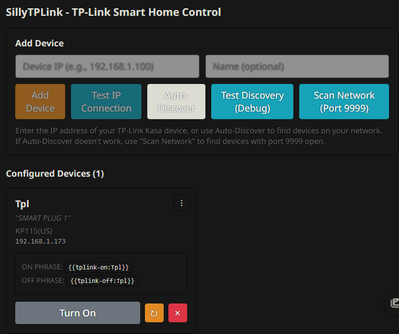

# SillyTPLink - TP-Link Smart Home Control for SillyTavern

Control your TP-Link Kasa smart home devices directly from SillyTavern using the local protocol - no cloud required.



## Requirements

- **SillyTavern**
- **[SillyTavern-PyRunner](https://github.com/mechamarmot/SillyTavern-PyRunner)** - Extension (auto-installs server plugin)
- **Python 3.7+**
- **TP-Link Kasa Devices** (see compatible devices at bottom)

## Installation

1. Install PyRunner extension (server plugin installs automatically)
2. Clone this repo to `SillyTavern/public/scripts/extensions/third-party/SillyTavern-Kasa`
3. Enable both PyRunner and SillyTPLink in extensions panel
4. Restart SillyTavern

## Quick Start

1. Click **Auto-Discover** to find devices on your network
2. Or manually add by IP address
3. Use the toggle button to test control
4. Devices appear with control phrases you can use in chat

## Usage

### Slash Commands

```
/tplink-on Lamp
/tplink-off Lamp
/tplink-toggle Lamp
/tplink-cycle Lamp 5
/tplink-status
```

The `/tplink-cycle` command turns a device on for a specified number of seconds, then automatically turns it off.

### Message Macros

**Available Macros:**
- `{{tplink-on:DeviceName}}` - Turn device on
- `{{tplink-off:DeviceName}}` - Turn device off  
- `{{tplink-cycle:DeviceName:seconds}}` - Turn on, wait, then turn off

**How it works:**
- Macros control the device when the message is rendered
- Visual feedback (e.g., `[Lamp ON]`) is shown to you in the chat
- **Both the macro AND the visual replacement are stripped from AI context**
- Other text in the message remains for the AI to see
- This prevents the AI from learning and repeating device control syntax

**Example:**
- You send: `Turn on the lamp {{tplink-on:Lamp}} please`
- You see: `Turn on the lamp [Lamp ON] please`
- AI sees: `Turn on the lamp please`

Embed control in messages:
```
Turn on the lights {{tplink-on:Living Room Light}} please!
```

Result:
```
Turn on the lights [Living Room Lamp ON] please!
```

**Cycle macro** - Turn on for a duration, then automatically turn off:
```
Activating the lamp {{tplink-cycle:Desk Lamp:5}} for 5 seconds
```

Result:
```
Activating the lamp [Desk Lamp CYCLED 5s] for 5 seconds
```

### Advanced Examples

**Timed automation with cycle macro:**
```
The lamp will flash {{tplink-cycle:Lamp:3}} as a notification
```

**Timed automation with slash commands:**
```
/tplink-on Lamp | /delay 10000 | /tplink-off Lamp
```

**Scene control:**
```
/tplink-on Living Room Light | /tplink-on Table Lamp | /echo Scene activated
```

## Device Management

- **Auto-Discover**: Broadcasts to find Kasa devices on your network
- **Network Scan**: Port-based scanning for devices on your subnet
- **Manual Entry**: Add devices by IP address
- **Rename/Description**: Right-click menu on device cards
- **Remove**: Delete devices you no longer need
- **Status Display**: Real-time status box shows recently controlled devices with countdown timers

### Status Display Box

A semi-transparent status box appears below the top menu when you control devices, showing:
- Device description and current state (ON/OFF)
- Live countdown timer for cycling devices
- Support for multiple devices simultaneously with independent timers
- Toggle visibility in extension settings
- Remove devices from display when OFF by clicking the × button

## Device Naming & Aliases

The extension tracks both the **actual TP-Link device name** (from the device firmware) and a **custom alias** you can set:

- **Original Name**: The device name configured in your TP-Link/Kasa app (automatically synced when you refresh)
- **Custom Alias**: A user-friendly name you set in SillyTavern (used in slash commands and macros)

**Why this matters**: When you rename a device in the TP-Link/Kasa app, the device's firmware name changes. The extension automatically syncs this when you click the refresh button (↻) on the device card, while your custom alias remains unchanged.

**Commands use your alias**: When you use `/tplink-on My_Lamp`, the extension finds the device by your custom alias but controls it via IP address, so commands always work regardless of name changes.

### Device Name Requirements

**Device names must follow these rules:**
- Single word only (no spaces)
- Alphanumeric characters and underscores only (`A-Z`, `a-z`, `0-9`, `_`)
- No special characters or hyphens
- Must be unique (case-insensitive)

**Auto-sanitization**: When adding devices, spaces are automatically replaced with underscores and special characters are removed. For example:
- `Living Room Lamp!` becomes `Living_Room_Lamp`
- `My Device #1` becomes `My_Device_1`

**Renaming**: When manually renaming devices, invalid characters will trigger an error. Use underscores instead of spaces.

## Compatible Devices

TP-Link **Kasa** devices using the local control protocol:

**Smart Plugs**: HS100, HS103, HS105, HS110, KP100, KP115, KP125, EP10, EP25
**Smart Switches**: HS200, HS210, HS220, KS200, KS220, KS230
**Smart Bulbs**: LB100-230 series, KL50, KL60, KL110-135 series
**Light Strips**: KL400, KL420, KL430
**Power Strips**: HS300, KP200, KP303, KP400

**Note**: Tapo and other TP-Link brands use different protocols and are not supported.

## How It Works

- Uses the reverse-engineered TP-Link Smart Home Protocol (port 9999)
- XOR autokey encryption for device communication
- No cloud connection required
- No authentication needed for local control

Based on [softScheck/tplink-smartplug](https://github.com/softScheck/tplink-smartplug)

## Troubleshooting

**PyRunner not available**: Install PyRunner extension and restart SillyTavern
**Device not found**: Check IP address, ensure same network, allow port 9999 in firewall
**Discovery fails**: Use Network Scan or Manual Entry instead
**Commands not working**: Wait 10 seconds after page load, then reload if needed

## Credits

- Author: mechamarmot
- Protocol: [softScheck/tplink-smartplug](https://github.com/softScheck/tplink-smartplug)
- Built with: React 18, Webpack 5, Python

## License

Apache 2.0 License

---

**Made for the SillyTavern community**
